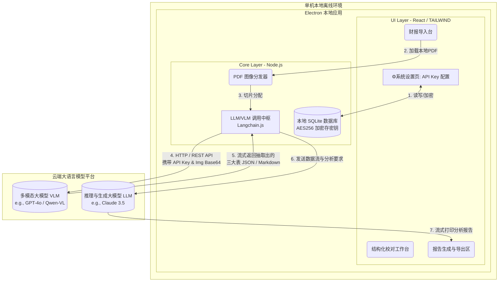

# 财报分析系统 (本地客户端 + 大模型云端算力) 架构演进方案

> 文档状态：Release
> 更新日期：2026-02-20
> 架构设计：全栈架构师 (Antigravity)
> 基于现状：基于原有 PRD 补充全新约束：**1. 单机运行的本地客户端；2. 提取与报告生成核心改用云端大模型算力（取代本地笨重的深度学习引擎）；3. 对外暴露大模型 API Key 配置页面**。此架构模式即典型的「瘦客户端模型 (Thin-Client with Cloud LLM/VLM)」。

---

## 1. 领域重构与核心挑战剖析

### 1.1 业务域边界调整
在原有的提取域（Extraction Domain）与 报告域（Reporting Domain）中：
- 原本强耦合在客户端的 PaddleX、OpenCV 等图像/文字坐标计算逻辑**被完全剥离抛弃**。
- 这两个核心域的实际执行者**转移为提供 OpenAPI 的第三方大模型云服务商**（如 OpenAI GPT-4o、Anthropic Claude 3.5 Sonnet、阿里 Qwen-VL 等多模态大模型）。

### 1.2 非功能需求 (NFR) 与约束
- **软件便携性：** 剔去庞大的本地深度学习组件后，安装包体积必须缩减 90% 以上（从 GB 级降至 百MB 级别），彻底消除打包和跨系统引发的 C++ 动态链接库闪退问题。
- **数据交互安全：** 客户端与大模型的全部通信直接通过 `https` 直连大模型官方 API，不经过任何居间中转服务器，保障企业财务 PDF 的隐私性（符合单机桌面单点部署的本质要求）。
- **用户自携私钥 (BYOK, Bring Your Own Key)：** 系统预留配置台，计费压力与 Token 消耗权交给客户端使用者自己。

---

## 2. 混合式瘦客户端技术选型

依据团队对于桌面应用开发的熟练度以及界面的现代化诉求，我们确立如下核心选型：

| 模块             | 推荐选型                           | 方案评估与商业收益                                                                                                                                 |
| ---------------- | ---------------------------------- | -------------------------------------------------------------------------------------------------------------------------------------------------- |
| **客户端框架**   | **Electron (Node.js) + React**     | 抛弃 PyQt5。利用现代 Web 前端栈打造丝滑的高亮交互表格与配置页。Electron 的主进程直接具备调用本地文件系统和加密存储能力，满足“单机运行”的刚性需求。 |
| **持久化层**     | **本地 SQLite (`better-sqlite3`)** | 取代之前的内存 `raw_df`。将用户的多份财报提取进度、API Key 密钥（需本地加密）以及 Markdown 模板沉淀在本地数据库。                                  |
| **模型粘合层**   | **LangChain.js / LlamaIndex.TS**   | 内置在 Electron 渲染/主进程中。负责将 PDF 预切片为图像数组，并编排与不同 VLM/LLM 的 API 对接流（Prompt 组装、Token 计算与流式解析 JSON）。         |
| **API 调用网关** | **Electron 主进程直连**            | 规避浏览器 CORS 跨域限制，Electron 的 Node 端直接发送 `fetch` 携带用户的 API Key 与多模态模型交互。                                                |

---

## 3. 端到端客户端系统架构 (C4 容器模型)

### 3.1 容器架构与数据流图

---

## 4. 关键接口与功能模块设计重置

### 4.1 全新：系统设置中心 (Settings Center)
- **UI 呈现**：在客户端左下角增加 `⚙️设置` 入口。
- **配置项**：
  - `[下拉菜单] 模型提供商 (Provider)`：例如 OpenAI, Anthropic, DeepSeek, 阿里云百炼等。
  - `[密码输入框] API Key`：由于 API Key 关联个人资产，必须由 Electron 主进程对接 `keytar`（系统密钥串存储工具）或存储在 SQLite 中时由设备的 MAC 地址加盐进行 AES-256 原地加密。
  - `[高级设置] Base URL`：支持企业内网反向代理或其他兼容 API 格式（如 OneAPI）的中转地址映射。

### 4.2 抽取引擎的“代际替换” (VLM 抽取流)
过去的 OCR 核心通过数百行 Python 规则寻找 `y_threshold`、`split_x` 与处理粘连。现在，所有的“脏活”被一句精炼的高级 Prompt 和云端千亿视觉参数彻底抹平：
1. **预处理**：利用 `pdf2pic` 或相似 Node 库把 PDF 在本地静默转化为高分辨率 Base64 图片集。
2. **VLM 分析**：分批将图片传入云端大模型，附加 `System Prompt` 强约束：“你是一个严谨的财务审计员。请无视该页面上的任何公司红色印章、水印或签名。精确识别页面上的《资产负债表》，并以严格对称的 8 列 JSON 数组形式一字不差地输出数字”。
3. **进度回填**：Electron 主进程通过 IPC `webContents.send` 将模型流式返回的进度和 Token 消耗金额打在 UI 层，极大缓解用户焦虑。

### 4.3 报告生成重塑与矩阵化架构 (Agentic Reporting)
过去的报告生成极度受限，而在大模型驱动下：
1. **轻量化数据反串联**：彻底打通从 PDF 解析出的内存 JSON，与外部系统脱机存留的 Excel 标准模板（通过 `ArrayBuffer` 的方式跨 Electron RPC 同步至底层的 Node `xlsx`）双源合并。
2. **多矩阵角色驱动引擎 (Role-based AI Matrix)**：应用抛弃了单一维度的评估，底层通过 TS 强约束沉淀出四套预置基座（中立审计、价值投资、经营剖析、信贷风控）。前端只提供业务极简的选择框，引擎内核执行不同的系统级身份映射发包指令，极大地深化了大模型撰写分析报告的结构化张力和精准命中程度。高级用户更可在白盒化抽屉里动态篡写这些身份的心智逻辑。

---

## 5. 架构演进的关键收益 (Why it wins)

1. **彻底攻克打包劫难**：客户端如今仅仅是一个包含 Node 引擎和 Chromium 壳子的 Web 应用。体积从几 GB 骤降到 80 MB。Windows、macOS(Intel/Apple Silicon)、Linux 无障碍秒级单文件编译出包 (`electron-builder`)，无需抗拒 C++ 依赖地狱。
2. **零维护抽取规则**：世界各地的财报版式千万种，原有的算术平均法、坐标对齐等写死代码的逻辑将永远面临边界 Case（比如一张长歪了的财报、一个扭曲的单元格）。而多模态模型本质上就是人类视觉的降维打击，它具有无限泛化能力。
3. **商业模式自洽**：使用客户端单机离线运行，满足财务数据的极度隐私合规；将高昂的算力成本转移给用户自身的 API Key，免去软件作者自身的服务器宽带或 GPU 采购的重资产投入。
